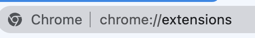
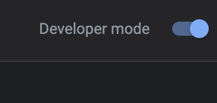
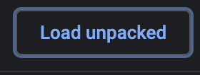
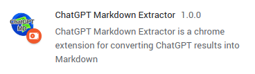
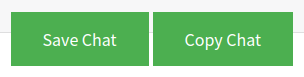

# ChatGPT Markdown Extractor
This project is forked from [chatgpt-keeper](https://github.com/wjrmffldrhrl/chatgpt-keeper).  
It's a script that extracts specific div values from an html file, and saves the text in markdown format.  

## Getting Started
Currently, this extension isn't offered from chrome web store.  
You need to download the zip and install it by loading unpacked project in Chrome developer mode.  
Please follow the steps written in the "How to Use" section to use it.

### Prerequisites
Chrome

### How to Use
The extension app is still under review, so please use the method below.  

1. Download the project zip file and unzip or git clone this repository
    - [Download link](https://github.com/BlueSkyDetector/chatgpt-keeper/archive/refs/heads/master.zip)
2. Access [chrome extensions](chrome://extensions/)  
  

3. Trun on developer mode  
  

4. Load unpacked project directory  
  

5. Check "ChatGPT Markdown Extractor" extension  
 

6. Talk to chatgpt and click the `Save Chat` button to download markdown file or `Copy Chat` button to copy the markdown contents to clipboard  
  

## License
This project is licensed under the MIT License - see the LICENSE.md file for details.
